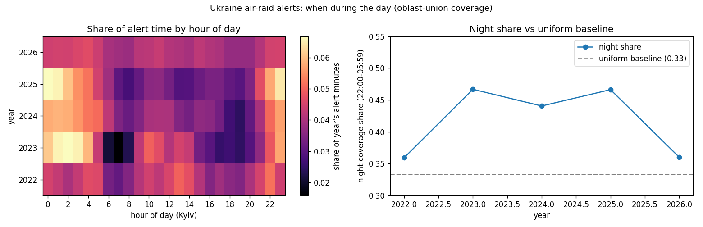

# Ukraine Air-Raid Alerts — Time-of-Day Analysis

When during the day do air-raid alerts happen in Ukraine, and has the pattern
become more nocturnal over the course of the war? This is a small, reproducible
analysis of public alert data, built to answer one question honestly — not to
plot graphs for their own sake, and not to predict attacks.



## The question and the answer

Air-raid alerts shifted from a **mixed day/night** profile in 2022 (peaks around
22:00 and 13:00–14:00) to a clearly **nocturnal** one from 2023 onward (peaks at
00:00–03:00 Kyiv time), consistent with the move to night-time drone campaigns.
The night share (share of alert time in 22:00–05:59) sits about **0.11–0.13 above
the 0.333 "no daily pattern" baseline** in 2023–2025.

We deliberately do **not** forecast attacks: alert timing is partly adversarial,
so a forecast would be unsound and inappropriate. Instead we measure the stable
structure and stay honest about what is irreducibly unpredictable.

## Run it

```bash
pip install -r requirements.txt
python pipeline.py       # downloads the data, builds marts under data/processed/
python sanity_check.py   # acceptance gate — should print ".. 0 failed"
streamlit run app.py     # dashboard (built in the dashboard phase)
```

## How it works — and the traps it avoids

The data is interval-based (one row per alert, timestamps in UTC). Three real data
issues drive the design; each is documented with its rationale in
[`spec.md`](spec.md):

- **Recording granularity changed** from oblast to raion over time, so raw row
  counts are *not* comparable across years. Every sub-oblast alert is merged into a
  single "oblast under alert" timeline (the oblast union), making the unit of
  analysis invariant to how finely alerts are recorded.
- **The raw file double-counts** almost every record from 2022–2025. Exact
  full-row duplicates are removed, which prevents a *fake* drop in the current year.
- **Timezone & DST**: timestamps are UTC but the question is about Kyiv local time.
  Conversion uses the IANA zone `Europe/Kyiv`, and intervals crossing midnight or a
  daylight-saving switch are handled explicitly.

## Project structure

```
src/config.py     constants: data source, paths, Europe/Kyiv, thresholds
src/timeutils.py  timezone conversion + DST-safe interval explosion
src/data.py       L0 -> L1: load/cache, dedup, clean, flag
src/aggregate.py  L1 -> L2: oblast union + hourly coverage marts
src/analysis.py   L2 -> answer: hour-share, night-share vs baseline, sanity plot
pipeline.py       orchestrate + persist marts
sanity_check.py   end-to-end acceptance gate
sample/           tiny CSV fixture for offline testing
spec.md           the project contract and rationale
```

## Limitations

- The current/latest year is partial, so its single yearly number is not a trend
  point and is not compared directly to full years.
- Permanent / stuck sirens (multi-hundred-day records) are excluded.
- Around the two yearly DST transitions, a couple of hours are attributed
  approximately; negligible once aggregated.

## Data & attribution

Data: [Vadimkin/ukrainian-air-raid-sirens-dataset](https://github.com/Vadimkin/ukrainian-air-raid-sirens-dataset)
— official alerts, with volunteer data collected via the eTryvoga channel. The
dataset is **not** redistributed here; `pipeline.py` downloads a fresh copy on
first run. A small `sample/` fixture is included only for offline testing.

## License

MIT (see [`LICENSE`](LICENSE)). The license covers this project's code, not the
dataset.
